# 易播服务端 C++17 重构 - 阶段一实现文档

## 📋 文档信息

**项目名称**: 易播服务端 C++17 重构项目
**阶段**: 阶段一 - 项目框架搭建
**完成日期**: 2026-01-19
**文档版本**: v1.0

---

## 🎯 阶段目标

阶段一的核心目标是搭建一个**现代化、可扩展、易维护**的C++17项目框架，为后续开发奠定坚实基础。

### 核心交付物

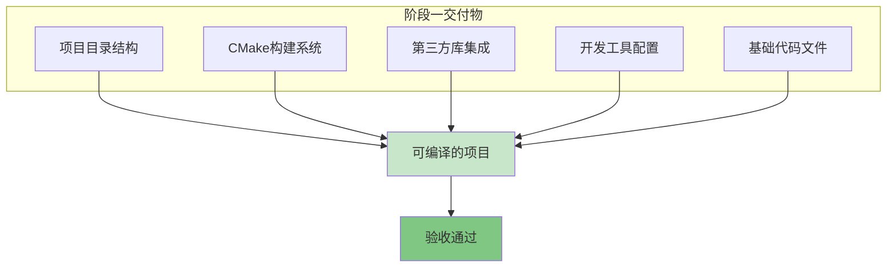

---

## 🏗️ 一、项目目录结构

### 1.1 目录结构设计

采用**基础分层结构**，清晰划分各个模块：

```
YiboServer/
├── include/              # 公共头文件目录
│   ├── common/          # 公共基础类
│   ├── network/         # 网络层接口
│   ├── concurrent/      # 并发层接口
│   ├── database/        # 数据库抽象层
│   └── utils/           # 工具类
├── src/                 # 源文件实现目录
│   ├── common/          # 公共基础类实现
│   ├── network/         # 网络层实现
│   ├── concurrent/      # 并发层实现
│   ├── database/        # 数据库层实现
│   ├── utils/           # 工具类实现
│   └── main.cpp         # 主程序入口
├── tests/               # 测试目录
│   ├── unit/           # 单元测试
│   └── integration/    # 集成测试
├── third_party/         # 第三方库目录
│   └── nlohmann/       # nlohmann/json库
│       └── json.hpp    # JSON单头文件
├── docs/                # 文档目录
├── build/               # 构建目录（gitignore）
├── CMakeLists.txt       # 根CMake配置
├── .clang-format        # 代码格式化配置
├── .gitignore           # Git忽略配置
└── README.md            # 项目说明文档
```

### 1.2 目录职责说明

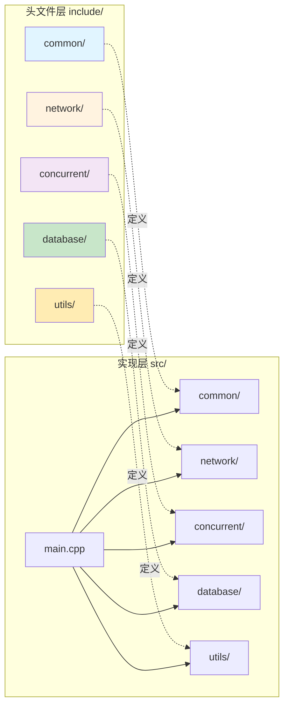

| 目录 | 职责 | 说明 |
|------|------|------|
| **include/common/** | 公共基础类、类型定义 | Buffer、智能指针别名、异常类等 |
| **include/network/** | 网络层接口 | Socket、Epoll、HTTP解析器等 |
| **include/concurrent/** | 并发层接口 | 线程、线程池、进程管理等 |
| **include/database/** | 数据库抽象层 | 数据库客户端、ORM等 |
| **include/utils/** | 工具类 | 字符串工具、时间工具等 |
| **src/** | 对应头文件的实现 | 各模块的.cpp实现文件 |
| **tests/** | 测试代码 | 单元测试和集成测试 |
| **third_party/** | 第三方库 | 外部依赖库 |

---

## ⚙️ 二、CMake构建系统

### 2.1 构建系统架构

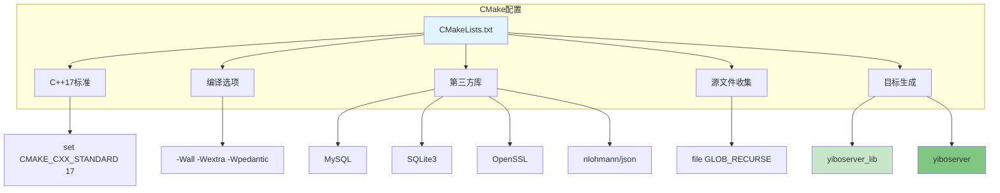

### 2.2 核心配置要点

#### C++17标准配置

```cmake
set(CMAKE_CXX_STANDARD 17)
set(CMAKE_CXX_STANDARD_REQUIRED ON)
set(CMAKE_CXX_EXTENSIONS OFF)
```

- **CMAKE_CXX_STANDARD 17**: 使用C++17标准
- **CMAKE_CXX_STANDARD_REQUIRED ON**: 强制要求C++17
- **CMAKE_CXX_EXTENSIONS OFF**: 禁用编译器扩展，确保可移植性

#### 编译选项配置

```cmake
add_compile_options(-Wall -Wextra -Wpedantic)
```

- **-Wall**: 启用所有警告
- **-Wextra**: 启用额外警告
- **-Wpedantic**: 严格遵循C++标准

#### Debug/Release模式

```cmake
set(CMAKE_CXX_FLAGS_DEBUG "${CMAKE_CXX_FLAGS_DEBUG} -g -O0 -DDEBUG")
set(CMAKE_CXX_FLAGS_RELEASE "${CMAKE_CXX_FLAGS_RELEASE} -O3 -DNDEBUG")
```

| 模式 | 优化级别 | 调试信息 | 宏定义 |
|------|---------|---------|--------|
| **Debug** | -O0 (无优化) | -g (包含) | -DDEBUG |
| **Release** | -O3 (最高优化) | 无 | -DNDEBUG |

### 2.3 第三方库集成

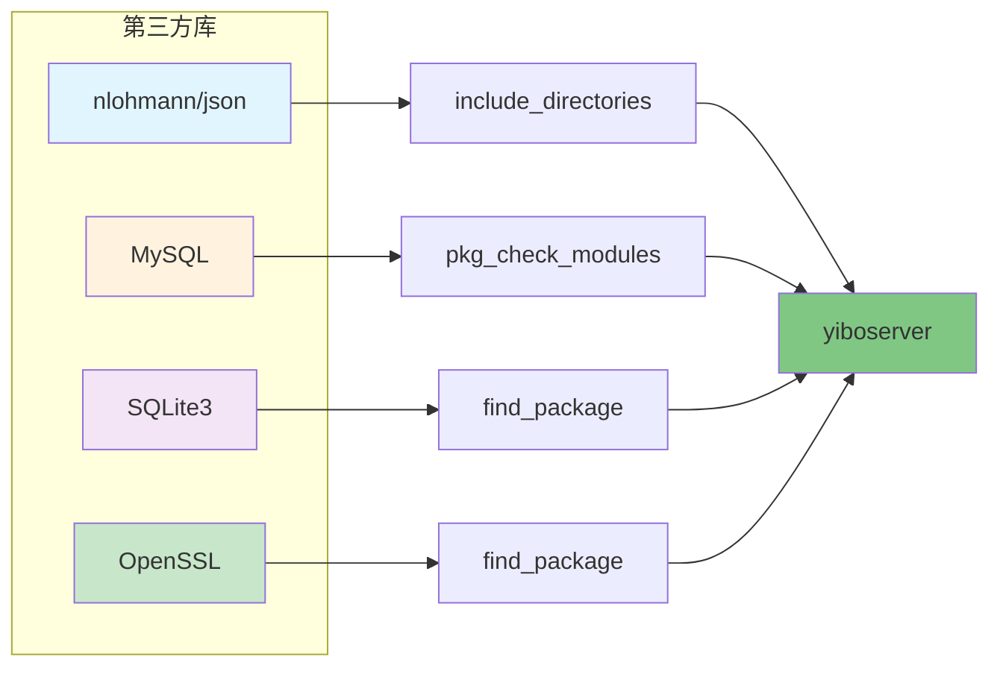

#### 库集成方式

| 库 | 集成方式 | 说明 |
|------|---------|------|
| **nlohmann/json** | 单头文件 | 直接include_directories |
| **MySQL** | pkg-config | pkg_check_modules查找 |
| **SQLite3** | CMake模块 | find_package查找 |
| **OpenSSL** | CMake模块 | find_package查找 |

### 2.4 构建目标

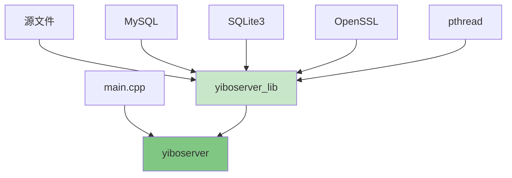

- **yiboserver_lib**: 静态库，包含所有模块实现
- **yiboserver**: 可执行文件，链接静态库和第三方库

---

## 📦 三、第三方库集成

### 3.1 库清单

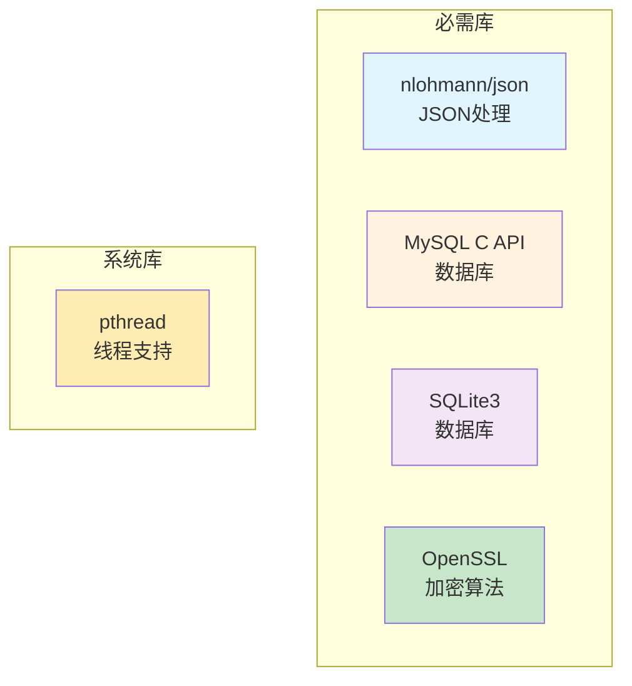

### 3.2 nlohmann/json

**版本**: v3.11.2
**类型**: 单头文件库
**大小**: 887KB

#### 集成方式

```bash
mkdir -p third_party/nlohmann
cd third_party/nlohmann
wget https://github.com/nlohmann/json/releases/download/v3.11.2/json.hpp
```

#### 使用示例

```cpp
#include <nlohmann/json.hpp>
using json = nlohmann::json;

json config;
config["version"] = "1.0.0";
config["phase"] = 1;
std::string output = config.dump(2);
```

### 3.3 MySQL C API

**包名**: libmysqlclient-dev
**版本**: 8.0.44

#### 安装方式

```bash
# Ubuntu/Debian
sudo apt-get install libmysqlclient-dev
```

#### CMake配置

```cmake
pkg_check_modules(MYSQL REQUIRED mysqlclient)
include_directories(${MYSQL_INCLUDE_DIRS})
link_directories(${MYSQL_LIBRARY_DIRS})
target_link_libraries(yiboserver ${MYSQL_LIBRARIES})
```

### 3.4 SQLite3

**包名**: libsqlite3-dev
**版本**: 3.37.2

#### 安装方式

```bash
# Ubuntu/Debian
sudo apt-get install libsqlite3-dev
```

#### CMake配置

```cmake
find_package(SQLite3 REQUIRED)
include_directories(${SQLite3_INCLUDE_DIRS})
target_link_libraries(yiboserver SQLite::SQLite3)
```

### 3.5 OpenSSL

**包名**: libssl-dev
**版本**: 3.0.2

#### 安装方式

```bash
# Ubuntu/Debian
sudo apt-get install libssl-dev
```

#### CMake配置

```cmake
find_package(OpenSSL REQUIRED)
include_directories(${OPENSSL_INCLUDE_DIR})
target_link_libraries(yiboserver OpenSSL::SSL OpenSSL::Crypto)
```

---

## 🛠️ 四、开发工具配置

### 4.1 代码格式化 (.clang-format)

#### 核心配置

```yaml
Language: Cpp
BasedOnStyle: Google
IndentWidth: 4
TabWidth: 4
UseTab: Never
ColumnLimit: 100
PointerAlignment: Left
ReferenceAlignment: Left
```

#### 配置说明

| 配置项 | 值 | 说明 |
|--------|-----|------|
| **BasedOnStyle** | Google | 基于Google C++风格 |
| **IndentWidth** | 4 | 缩进宽度4个空格 |
| **ColumnLimit** | 100 | 每行最多100字符 |
| **PointerAlignment** | Left | 指针靠左对齐 |

### 4.2 Git忽略配置 (.gitignore)

```gitignore
# 构建目录
build/
cmake-build-*/

# 编译产物
*.o
*.a
*.so

# IDE配置
.vscode/
.idea/

# 日志和数据库文件
*.log
*.db
*.sqlite
```

---

## 💻 五、基础代码实现

### 5.1 Public.h - 公共基础类

**文件路径**: `include/common/Public.h`

```cpp
#pragma once

#include <memory>
#include <string>

// 智能指针别名
template<typename T>
using UniquePtr = std::unique_ptr<T>;

template<typename T>
using SharedPtr = std::shared_ptr<T>;

// Buffer类型（继承std::string）
class Buffer : public std::string {
public:
    using std::string::string;
    operator const char*() const { return c_str(); }
};
```

#### 设计说明

```mermaid
classDiagram
    class UniquePtr~T~ {
        <<alias>>
        std::unique_ptr~T~
    }

    class SharedPtr~T~ {
        <<alias>>
        std::shared_ptr~T~
    }

    class Buffer {
        +Buffer()
        +operator const char*()
    }

    std::string <|-- Buffer

    style Buffer fill:#e1f5ff
```

| 组件 | 类型 | 说明 |
|------|------|------|
| **UniquePtr** | 模板别名 | 独占所有权智能指针 |
| **SharedPtr** | 模板别名 | 共享所有权智能指针 |
| **Buffer** | 类 | 继承std::string，添加隐式转换 |

### 5.2 main.cpp - 主程序入口

**文件路径**: `src/main.cpp`

```cpp
#include <iostream>
#include <nlohmann/json.hpp>
#include "common/Public.h"

using json = nlohmann::json;

int main() {
    std::cout << "YiboServer C++17 - Phase 1 Framework Setup\n";

    // 测试nlohmann/json
    json config;
    config["version"] = "1.0.0";
    config["phase"] = 1;
    std::cout << "Config: " << config.dump(2) << "\n";

    // 测试Buffer类
    Buffer msg = "Hello, YiboServer!";
    std::cout << "Message: " << msg << "\n";

    return 0;
}
```

#### 程序流程

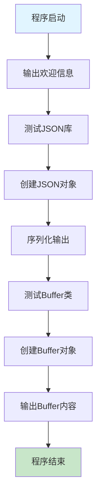

---

## 🔨 六、构建与验证

### 6.1 构建流程


#### 构建命令

```bash
# 1. 创建构建目录
mkdir build && cd build

# 2. CMake配置
cmake ..

# 3. 编译项目
make -j$(nproc)

# 4. 运行程序
./yiboserver
```

### 6.2 构建输出

#### CMake配置输出

```
-- Build type: Release
-- Found PkgConfig: /usr/bin/pkg-config (found version "0.29.2")
-- Checking for module 'mysqlclient'
--   Found mysqlclient, version 21.2.44
-- Found SQLite3: /usr/include (found version "3.37.2")
-- Found OpenSSL: /usr/lib/x86_64-linux-gnu/libcrypto.so (found version "3.0.2")
-- Configuring done
-- Generating done
-- Build files have been written to: /root/projects/YiboServer/build
```

#### 编译输出

```
[ 50%] Building CXX object CMakeFiles/yiboserver.dir/src/main.cpp.o
[100%] Linking CXX executable yiboserver
[100%] Built target yiboserver
```

#### 运行输出

```
YiboServer C++17 - Phase 1 Framework Setup
Config: {
  "phase": 1,
  "version": "1.0.0"
}
Message: Hello, YiboServer!
```

### 6.3 验证结果

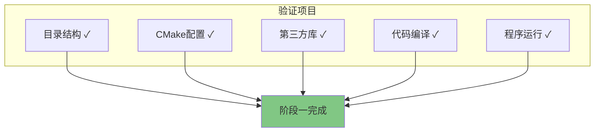

| 验证项 | 状态 | 说明 |
|--------|------|------|
| **目录结构** | ✅ 通过 | 所有目录创建完成 |
| **CMake配置** | ✅ 通过 | 配置无错误 |
| **第三方库** | ✅ 通过 | 所有库正确集成 |
| **代码编译** | ✅ 通过 | 无警告无错误 |
| **程序运行** | ✅ 通过 | 输出符合预期 |

---

## 📊 七、技术栈总结

### 7.1 技术选型

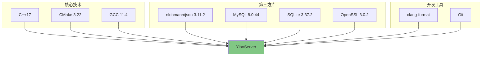

### 7.2 技术栈对比

| 组件 | 原项目 | 重构项目 | 优势 |
|------|--------|---------|------|
| **语言标准** | C++11 | C++17 | 更多现代特性 |
| **构建系统** | Makefile | CMake | 跨平台、易维护 |
| **JSON库** | JsonCpp | nlohmann/json | 更现代、易用 |
| **内存管理** | 手动new/delete | 智能指针 | 更安全 |
| **代码风格** | 不统一 | clang-format | 统一规范 |

---

## 🎯 八、阶段成果

### 8.1 完成清单

- ✅ 项目目录结构创建完成
- ✅ CMakeLists.txt配置完成
- ✅ nlohmann/json库集成完成
- ✅ MySQL/SQLite/OpenSSL配置完成
- ✅ Public.h基础类实现完成
- ✅ main.cpp测试程序完成
- ✅ .clang-format配置完成
- ✅ .gitignore配置完成
- ✅ README.md文档完成
- ✅ 项目编译通过
- ✅ 程序运行验证通过

### 8.2 项目统计

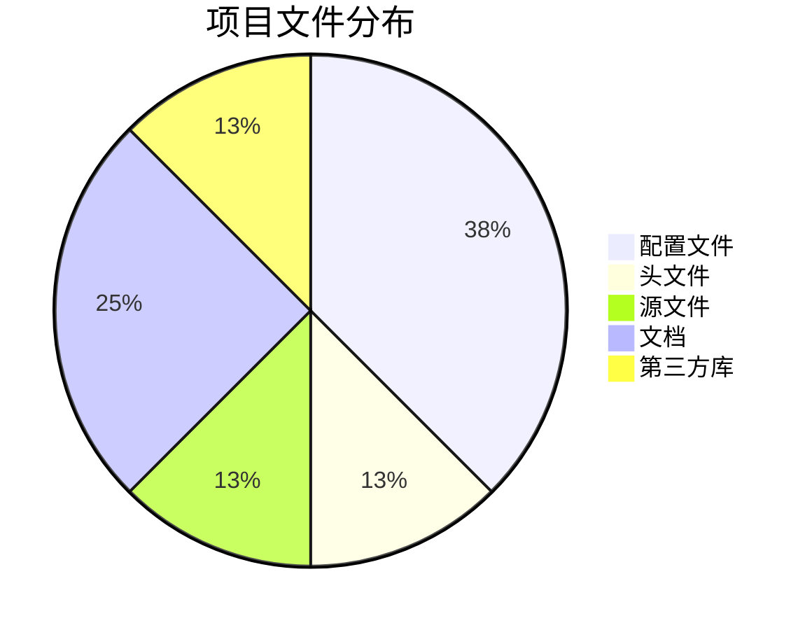

| 类型 | 数量 | 说明 |
|------|------|------|
| **配置文件** | 3 | CMakeLists.txt, .clang-format, .gitignore |
| **头文件** | 1 | Public.h |
| **源文件** | 1 | main.cpp |
| **文档** | 2 | README.md, phase1_implementation.md |
| **第三方库** | 1 | json.hpp |

### 8.3 代码统计

| 指标 | 数量 |
|------|------|
| **总行数** | ~200行 |
| **头文件** | 1个 |
| **源文件** | 1个 |
| **配置文件** | 3个 |
| **第三方库** | 4个 |

---

## 🚀 九、下一步计划

### 9.1 阶段二：公共基础类库

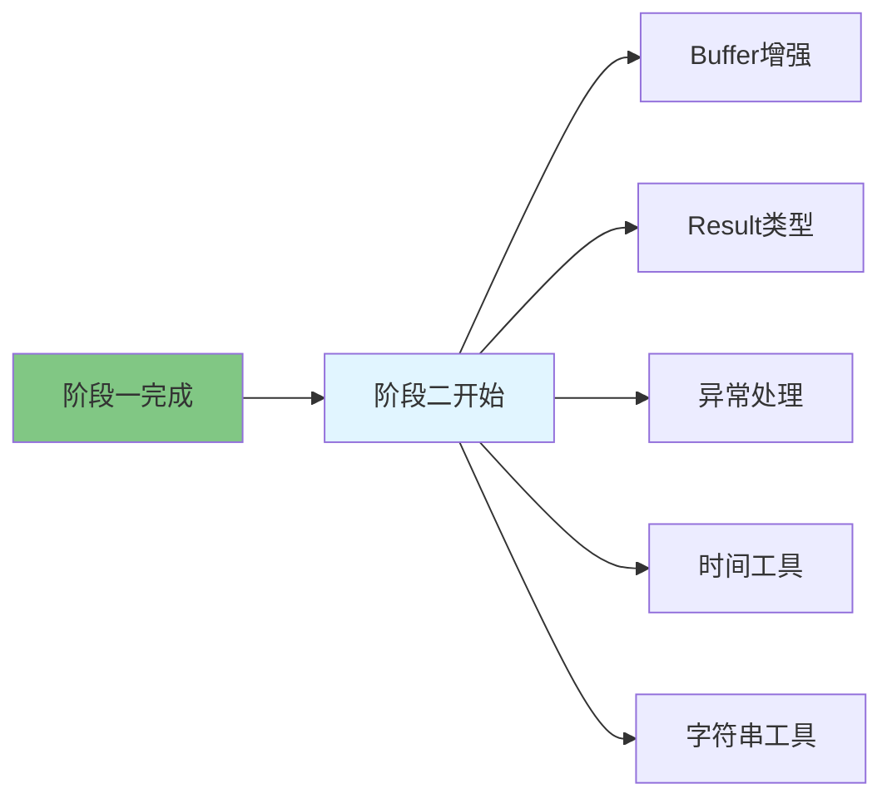

#### 计划实现内容

| 模块 | 内容 | 优先级 |
|------|------|--------|
| **Buffer类** | 增强功能、性能优化 | 高 |
| **Result类型** | 错误处理机制 | 高 |
| **异常类** | 自定义异常体系 | 中 |
| **时间工具** | 时间格式化、转换 | 中 |
| **字符串工具** | 字符串处理函数 | 中 |

### 9.2 后续阶段概览

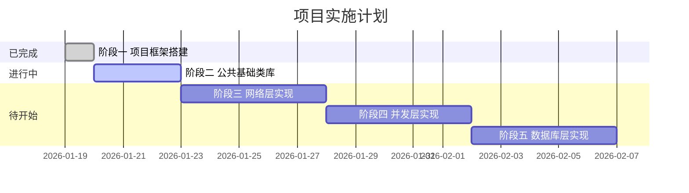

---

## 📝 十、总结

### 10.1 关键成就

1. **现代化框架**: 成功搭建基于C++17的现代化项目框架
2. **模块化设计**: 清晰的目录结构，便于后续开发和维护
3. **标准化构建**: 使用CMake实现跨平台构建系统
4. **第三方集成**: 成功集成所有必需的第三方库
5. **开发规范**: 建立代码格式化和版本控制规范

### 10.2 技术亮点

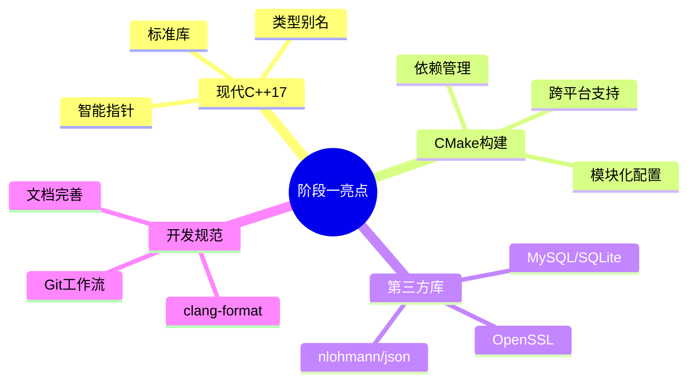

### 10.3 经验总结

1. **目录结构**: 清晰的模块划分是项目成功的基础
2. **构建系统**: CMake的现代化配置提高了可维护性
3. **第三方库**: 合理选择第三方库可以提高开发效率
4. **代码规范**: 统一的代码风格有助于团队协作
5. **文档先行**: 完善的文档是项目可持续发展的保障

---

## 📚 附录

### A. 参考资料

- [CMake官方文档](https://cmake.org/documentation/)
- [C++17标准](https://en.cppreference.com/w/cpp/17)
- [nlohmann/json文档](https://json.nlohmann.me/)
- [Google C++ Style Guide](https://google.github.io/styleguide/cppguide.html)

### B. 常见问题

#### Q1: CMake找不到MySQL怎么办？

**A**: 确保安装了libmysqlclient-dev包，并使用pkg-config查找。

#### Q2: 如何切换Debug/Release模式？

**A**: 使用`cmake -DCMAKE_BUILD_TYPE=Debug ..`或`Release`。

#### Q3: 如何格式化代码？

**A**: 运行`clang-format -i src/**/*.cpp include/**/*.h`。

### C. 版本历史

| 版本 | 日期 | 说明 |
|------|------|------|
| v1.0 | 2026-01-19 | 初始版本，阶段一完成 |

---

**文档结束**

*本文档由易播服务端C++17重构项目组编写*
*最后更新: 2026-01-19*
